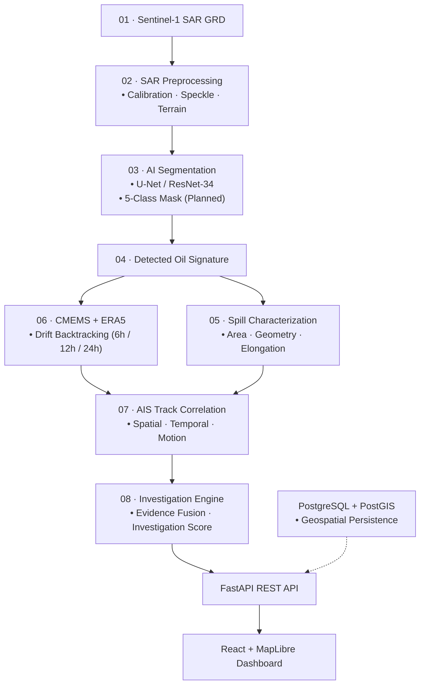

# OceanIntel

### Satellite-Based Oil Spill Detection & Maritime Investigation Intelligence

**Smart India Hackathon 2026 · SIH26143**

OceanIntel is a geospatial intelligence system that combines Sentinel-1 SAR imagery, AI-based segmentation, spill characterization, environmental drift modelling, and AIS correlation to support marine oil-spill investigations. The system transforms a detected spill signature into a spatial-temporal investigation corridor and produces ranked candidate vessels.

---

## Overview

An oil slick detected in satellite imagery may not represent the original discharge location because ocean surface currents and winds continuously displace and deform the slick. OceanIntel addresses this spatial-temporal decoupling by connecting:

$$\text{Sentinel-1 SAR} \longrightarrow \text{AI Detection} \longrightarrow \text{Spill Characterization} \longrightarrow \text{Drift Backtracking} \longrightarrow \text{AIS Correlation} \longrightarrow \text{Evidence Fusion}$$

The output is a prioritized roster of **Investigation Candidates** evaluated by a deterministic **Investigation Score**. OceanIntel is an investigative decision-support system; it does **not** legally determine responsible vessels or identify "culprits", "guilty vessels", or "confirmed polluters". Telemetry dropouts are classified as **AIS observation gaps** (missing data), not proof of intentional shutdown.

---

## Architecture



- **01 · Sentinel-1 SAR GRD:** Ingests Level-1 Ground Range Detected C-band SAR products.
- **02 · SAR Preprocessing:** Converts linear radar amplitude to decibels ($10 \log_{10}$) and normalizes intensities to $[0, 1]$.
- **03 · AI Segmentation:** Segments anomalous low-backscatter dark spots from the sea surface using deep learning.
- **04 · Detected Oil Signature:** Merges sliding-window probability tiles into a full-scene georeferenced detection mask.
- **05 · Spill Characterization:** Computes physical slick metrics including area ($\text{km}^2$), perimeter, elongation, and GeoJSON vectors.
- **06 · CMEMS + ERA5:** Inverts ocean currents and wind forcing to simulate backward drift trajectories and origin corridors.
- **07 · AIS Track Correlation:** Intersects historical vessel voyages with backtrack corridors across spatial and temporal windows.
- **08 · Investigation Engine:** Fuses multi-factor indicators with reliability priors to rank candidate vessels.
- **Platform Layer:** FastAPI serves REST endpoints, React + MapLibre GL powers the workstation UI, and PostgreSQL/PostGIS provides planned spatial storage.

---

## Key Capabilities

| Layer | Capability |
|---|---|
| **SAR** | Sentinel-1 SAR GRD ingestion, linear-to-dB conversion, and geospatial coordinate handling. |
| **AI** | Deep-learning oil-spill segmentation using a U-Net architecture with ResNet-34 encoder. |
| **Characterization** | Physical slick surface area ($\text{km}^2$), perimeter, geometry, elongation, and GeoJSON extraction. |
| **Drift** | 2D kinematic particle trajectory modeling with current, windage (1–4%), and backward drift corridors. |
| **AIS** | Spatial distance decay, temporal window overlap, speed profiling, and telemetry gap tracking. |
| **Evidence** | Multi-factor evidence fusion producing a deterministic Investigation Score and completeness metric. |
| **Dashboard** | 13-workstation React console with MapLibre GL vector mapping and live GeoTIFF upload. |

---

## Implementation Status

| Component | Status |
|---|:---:|
| SAR Preprocessing | 🟡 Prototype |
| AI Segmentation | ✅ Implemented |
| Spill Characterization | ✅ Implemented |
| Drift Modelling | 🟠 Prototype / Simulated |
| AIS Correlation | 🟡 Prototype |
| Evidence Engine | ✅ Implemented |
| FastAPI + React/MapLibre | ✅ Implemented |
| PostgreSQL / PostGIS | 🔵 Planned |

---

## Machine Learning

| Parameter | Current Implementation |
|---|---|
| **Framework** | PyTorch (`torch` >= 2.9.0) / `segmentation-models-pytorch` |
| **Architecture** | U-Net |
| **Encoder** | ResNet-34 (Pre-trained on ImageNet) |
| **Input** | Single-channel SAR (VV backscatter amplitude/dB) |
| **Output** | Binary segmentation (`classes=1`, Oil vs. Background) |
| **Loss** | `torch.nn.BCEWithLogitsLoss` with dynamic positive class weighting (`pos_weight` ~34.89) |
| **Optimizer** | AdamW (learning rate: $1 \times 10^{-4}$) |

*Current repository implementation uses binary oil-vs-background segmentation. The broader 5-class segmentation shown in the system architecture represents the intended model direction.*

- **Validation (Epoch 4):** Dice: `0.6963` · IoU: `0.5417`
- **Held-Out Test Scenes (7 Scenes Overall):** Dice: `0.3980` · IoU: `0.3128`
- **Model Checkpoints:** Trained model weights are not included in the repository; initialize via `create_dummy_model.py` or train via `train.py`.

---

## Data & Research

### Datasets
- **Gulf of Mexico Sentinel-1 SAR Dataset:** Used for model training and held-out evaluation (Zenodo [4672426](https://zenodo.org/records/4672426)).
- **Trujillo SAR Oil Spill Dataset:** Multi-region benchmark and validation reference (Zenodo [8208466](https://zenodo.org/record/8208466)).
- **Peruvian Coastal SAR Dataset:** Academic case study reference for the Ventanilla spill (IEEE DataPort).

### Research
1. **Longépé et al. (2015)** — *Polluter identification with spaceborne radar imagery, AIS and forward drift modeling.* Marine Pollution Bulletin.
2. **Trujillo-Acatitla et al. (2024)** — *Marine oil spill detection and segmentation in SAR data with two steps Deep Learning framework.* International Journal of Remote Sensing.
3. **Luo et al. (2024)** — *A new ship tracing technology from oil spills based on multi-source data.* Journal of Marine Science and Engineering.
4. **Krestenitis et al. (2019)** — *Oil spill segmentation in SAR images using convolutional neural networks.* Remote Sensing.
5. **Cheng et al. (2025)** — *Automated oil spill detection using deep learning and SAR satellite data.* Environmental Pollution.

---

## Quick Start

### Frontend
```bash
npm install
npm run dev
```

### Backend
```bash
cd model_repo
python -m venv venv
.\venv\Scripts\activate        # Linux/macOS: source venv/bin/activate
pip install -e ".[dev]"
python create_dummy_model.py   # Generates baseline initialized model checkpoint
```

### Full Stack
```bash
npm run dev:full
```

- **Frontend Console:** [http://localhost:5173/](http://localhost:5173/)
- **Backend API:** [http://127.0.0.1:8000/health](http://127.0.0.1:8000/health)

---

## Testing

```bash
cd model_repo
pytest
```

46 automated tests were verified during repository auditing. These tests validate engineering behavior and deterministic processing; they do not establish real-world detection accuracy.

---

## References

- **Data Platforms:** [Copernicus Sentinel-1](https://sentinels.copernicus.eu/web/sentinel/missions/sentinel-1) · [Copernicus Marine Service (CMEMS)](https://marine.copernicus.eu/) · [ECMWF ERA5 Reanalysis](https://www.ecmwf.int/en/forecasts/dataset/ecmwf-reanalysis-v5)
- **AIS Platforms:** [AISStream](https://aisstream.io/) · [Global Fishing Watch](https://globalfishingwatch.org/)
- **Case Studies:** Ventanilla / Repsol Spill (Peru, 2022) · Deepwater Horizon (Gulf of Mexico, 2010)

---

## Responsible Use

> OceanIntel provides investigation-support intelligence, not legal attribution. A ranked vessel candidate is not proof of responsibility. AIS observation gaps represent missing evidence, not proof of intentional shutdown. Drift predictions contain uncertainty and require independent validation before operational or legal decisions.
