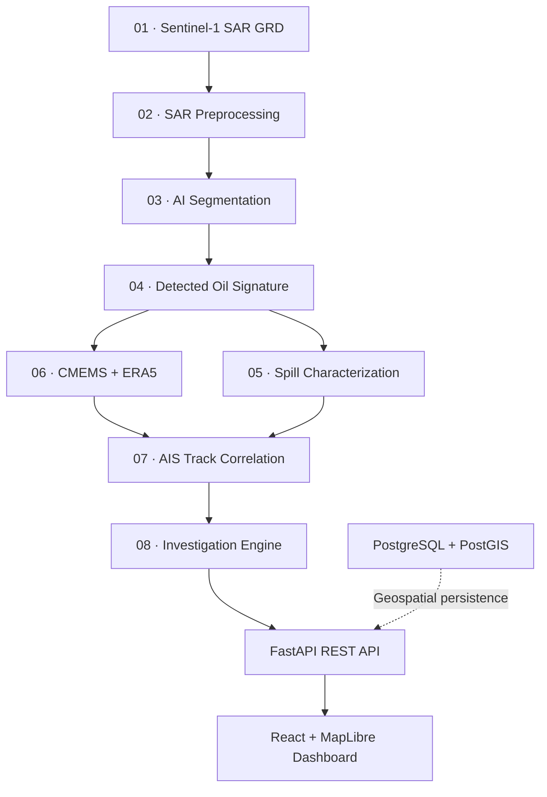

# OceanIntel
### Satellite-Based Oil Spill Detection & Maritime Investigation Intelligence

**Smart India Hackathon 2026 · Problem Statement SIH26143**

OceanIntel is a geospatial intelligence prototype for detecting potential marine oil-spill signatures from Sentinel-1 SAR imagery and correlating them with environmental drift and AIS vessel trajectories. The system combines computer vision, geospatial analysis, drift modelling, and evidence fusion to produce ranked investigation candidates.

---

## Overview

Satellite imagery can reveal potential oil signatures across open ocean waters, but an observed slick is routinely displaced from its original discharge location by ocean surface currents and winds. AIS vessel tracking alone cannot resolve this spatial-temporal decoupling, as vessels continue transit while slicks deform and drift over hours or days.

OceanIntel combines:
$$\text{SAR Imagery} + \text{AI Detection} + \text{Spill Characterization} + \text{Drift Backtracking} + \text{AIS Correlation} + \text{Evidence Fusion}$$
to reconstruct candidate discharge corridors and correlate historical vessel transits to support maritime environmental investigations.

> [!IMPORTANT]
> **Decision-Support Boundary:** OceanIntel is a decision-support system designed to assist maritime authorities and environmental investigators. It does **NOT** legally determine the responsible vessel or establish legal culpability. The system outputs **Investigation Candidates** (e.g., *Highest-Priority Investigation Candidate*, *Candidate Vessel*) evaluated by a deterministic **Investigation Score**. It does not output "guilty vessels", "culprits", or "confirmed polluters". Telemetry dropouts are designated as **AIS observation gaps** (missing evidence), not proof of deliberate transponder deactivation.

---

## System Architecture



- **01 · Sentinel-1 SAR GRD:** Ingests single-channel Level-1 Ground Range Detected C-band SAR products.
- **02 · SAR Preprocessing:** Converts linear backscatter to decibels ($10 \log_{10}$) and normalizes pixel intensities to $[0, 1]$.
- **03 · AI Segmentation:** Predicts anomalous dark-spot backscatter using a deep learning segmentation network.
- **04 · Detected Oil Signature:** Assembles full-scene binary detection masks using windowed probability accumulation.
- **05 · Spill Characterization:** Computes physical geometry, real-world area ($\text{km}^2$), elongation, and GeoJSON vectors.
- **06 · CMEMS + ERA5:** Inverts ocean currents and wind forcing to simulate historical backward drift trajectory envelopes.
- **07 · AIS Track Correlation:** Intersects historical vessel tracks with backtrack corridors across space and time windows.
- **08 · Investigation Engine:** Fuses multi-modal evidence with reliability priors into a ranked candidate investigation table.
- **Platform Layer:** FastAPI exposes inference endpoints; React + MapLibre GL powers the workstation UI; PostGIS provides planned spatial storage.

---

## Key Capabilities

| Layer | Capability |
|---|---|
| **SAR Intelligence** | Sentinel-1 Level-1 GRD ingestion, linear-to-dB conversion, and geospatial affine coordinate handling. |
| **AI Segmentation** | U-Net with ResNet-34 encoder detecting oil slicks against sea background via tiled sliding windows. |
| **Characterization** | Morphological filtering, connected components, area ($\text{km}^2$), perimeter, elongation, compactness, and GeoJSON export. |
| **Drift Intelligence** | 2D kinematic Euler particle transport over WGS84 modeling current, windage (1–4%), and trajectory backtracking. |
| **AIS Maritime** | Ingestion of vessel trajectories, spatial distance decay scoring, temporal window matching, and gap tracking. |
| **Evidence Fusion** | Deterministic multi-factor scoring combining spatial, temporal, drift, behavior, and track quality indicators. |
| **Geospatial Map** | Interactive vector mapping rendering slicks, drift corridors, candidate vessel routes, and exclusion zones. |
| **Dashboard** | 13-workstation React console with live GeoTIFF upload, incident metrics, and dossier report generation. |

---

## Implementation Status

| Component | Status | Details |
|---|:---:|---|
| **SAR Preprocessing** | 🟡 Prototype | Linear-to-dB and $[0, 1]$ scaling implemented; `apply_lee_filter` is currently a placeholder. |
| **AI Segmentation** | ✅ Implemented | ResNet-34 U-Net binary model (`classes=1`) with positive class weighting and tiled inference. |
| **Spill Characterization** | ✅ Implemented | Connected component labeling, area ($\text{km}^2$), elongation, compactness, and GeoJSON output. |
| **Drift Modelling** | 🟠 Simulated forcing | 2D kinematic particle backtracking implemented; driven by synthetic environmental test fixtures. |
| **AIS Correlation** | 🟡 Prototype | `OfflineAISProvider` (CSV/in-memory) functional; live streaming and external REST adapters are stubs. |
| **Evidence Engine** | ✅ Implemented | Deterministic fusion, evidence completeness scoring, and non-causal identity isolation. |
| **FastAPI Backend** | ✅ Implemented | Endpoints `GET /health` and `POST /api/v1/inference` active and connected. |
| **MapLibre Dashboard** | ✅ Implemented | 13 workstation pages in React 19 + MapLibre GL with OpenFreeMap vector basemaps. |
| **PostgreSQL / PostGIS** | 🔵 Planned | State currently handled in-memory and via local GeoTIFF, GeoJSON, and CSV files. |
| **Real-World Validation** | 🟡 Prototype | Evaluated offline on 7 held-out Gulf of Mexico SAR scenes; live operational trials pending. |

---

## Machine Learning

The AI segmentation engine uses an ImageNet-pretrained ResNet-34 backbone in a U-Net architecture (`segmentation-models-pytorch`).

| Parameter | Current Implementation |
|---|---|
| **Framework** | PyTorch (`torch` >= 2.9.0) / `segmentation-models-pytorch` |
| **Architecture** | U-Net |
| **Encoder** | ResNet-34 (Pre-trained on ImageNet) |
| **Input** | Single-channel SAR (VV backscatter amplitude/dB) |
| **Output** | Binary segmentation (`classes=1`, Oil vs. Background) |
| **Loss** | `torch.nn.BCEWithLogitsLoss` with dynamic positive class weighting (`pos_weight` ~34.89) |
| **Optimizer** | AdamW (learning rate: $1 \times 10^{-4}$) |
| **Inference Window** | 256 × 256 pixels with 128-pixel stride (50% spatial overlap) and accumulator blending |

> [!NOTE]
> **Architecture Scope:** Current implementation uses **binary segmentation**. Multi-class segmentation (distinguishing oil, look-alikes, ships, land, and sea) is a planned future enhancement. **Trained model weights are not included in the current repository**; checkpoints are initialized via `create_dummy_model.py` or trained via `train.py`.

### Evaluation Summary (Gulf of Mexico Sentinel-1 Dataset)
- **Validation (Epoch 4):** Dice / F1: `0.6963` · IoU: `0.5417` · Precision: `0.5435` · Recall: `0.9899`
- **Held-Out Test Scenes (7 Scenes Overall):** Dice / F1: `0.3980` · IoU: `0.3128` · Precision: `0.3357` · Recall: `0.5642`
- **Generalization:** Per-scene test IoU ranges from `0.1504` to `0.6011`, reflecting sensitivity to variable sea surface roughness and wind speeds.

---

## Data

| Dataset / Source | Role | Status |
|---|---|---|
| **Gulf of Mexico Sentinel-1 SAR** | Model training and held-out evaluation | Real data · Download script in `scripts/data_acquisition/download_gom.py` (Zenodo [4672426](https://zenodo.org/records/4672426)) |
| **Trujillo SAR Oil Spill Dataset** | Multi-region benchmark and validation reference | Real data · Download script in `scripts/data_acquisition/download_trujillo.py` (Zenodo [8208466](https://zenodo.org/record/8208466)) |
| **Peruvian Coastal SAR Dataset** | Academic case study reference (Ventanilla spill) | Real data · Audited in documentation; IEEE DataPort reference |
| **Synthetic Test Masks** | Automated unit test suites (`tests/fixtures/`) | Synthetic data · Deterministic NumPy geometric shapes |
| **Persian Gulf Incident (`SPILL-2026-047`)** | Centralized UI demonstration store (`src/data/demo/`) | Demo data · Mock incident coordinates, candidate vessels, and metocean vectors |

*Raw raster datasets are not stored directly in version control.*

---

## Running Locally

### 1. Frontend Setup
```bash
# In repository root
npm install
npm run dev
```

### 2. Backend Setup
```bash
cd model_repo
python -m venv venv

# Windows (PowerShell)
.\venv\Scripts\activate
# Linux / macOS
source venv/bin/activate

pip install -e ".[dev]"
python create_dummy_model.py   # Generates baseline initialized model checkpoint
```

### 3. Full Stack Execution
To run both backend API and frontend dev server concurrently:
```bash
npm run dev:full
```

- **Frontend Console:** [http://localhost:5173/](http://localhost:5173/)
- **Backend Health Check:** [http://127.0.0.1:8000/health](http://127.0.0.1:8000/health)
- **CLI Pipeline:** `cd model_repo && python scripts/run_e2e_pipeline.py --input path/to/scene.tif`

---

## Environment Variables

Configuration options are templated in `model_repo/.env.example`:
- `PROJECT_NAME`: Project identifier (`sih26143-oil-spill`)
- `ENVIRONMENT`: Runtime mode (`development` / `production`)
- `BACKEND_HOST` / `BACKEND_PORT`: Binding host (`127.0.0.1`) and port (`8000`)
- `COPERNICUS_USERNAME` / `COPERNICUS_PASSWORD`: Optional credentials for satellite scene downloads
- `AISSTREAM_API_KEY` / `GFW_API_KEY`: Optional external AIS keys (live streaming remains a skeleton adapter)

> [!CAUTION]
> **Security & Map Engine:** The active map visualization engine is **MapLibre GL JS + OpenFreeMap** (no API key required). Google Maps is not active in code; if integrated in future phases, credentials must be supplied via `VITE_GOOGLE_MAPS_API_KEY`. Never commit secrets, passwords, or `.env` files to git.

---

## Demo Mode

> **DEMO MODE · SIMULATED DATA**

The web console operates in Demo Mode by default using incident `SPILL-2026-047` centered in the Central Persian Gulf (`26.15°N, 51.80°E`):
- **Simulated Metocean:** Current 0.75 kn at 135°; wind forcing 12.4 kn at 310°.
- **Simulated Candidates:** 4 vessels (`MT ARGO GLORY`, `PACIFIC HORIZON`, `SEA BRAVERY`, `AL-BARAKA 9`) with synthetic tracks.
- **Simulated Envelopes:** Backward drift cones and coastal impact zones generated via synthetic particle dispersion.
- **Operational Transition:** Demo components display yellow status badges. Uploading a real SAR GeoTIFF in Spill Intelligence switches the status to `LIVE · SAR INFERENCE`. Demo values must never be presented as real-world satellite observations.

---

## Testing

```bash
cd model_repo
pytest
```

- **Audit Result:** **46 automated tests were verified during repository auditing** (~67 test functions across 12 modules in `tests/unit/` and `tests/integration/`).
- **Scope:** Validates deterministic matrix operations, sliding-window tile extraction, coordinate reprojection, 2D particle integration, and multi-factor evidence scoring.
- **Caveat:** These tests validate engineering behavior and deterministic processing; they do not establish real-world detection accuracy.

---

## Scientific Limitations

- **Look-Alike Ambiguity:** Low-wind areas (< 3 m/s), biogenic algal films, and internal waves produce dark SAR backscatter signatures that can trigger false positives without auxiliary metocean gating.
- **Binary Segmentation:** Current model detects dark spots versus ocean background; it does not classify oil thickness, crude vs. refined products, or segment ships/land at the pixel level.
- **Simulated Forcing:** Particle drift uses synthetic velocity fields; operational CMEMS and ERA5 integration is architecturally defined but not connected.
- **AIS Limitations:** Historical AIS operates via offline CSV files; live WebSocket streaming and Global Fishing Watch REST querying remain skeleton stubs.
- **Geographic Generalization:** Trained on Gulf of Mexico Sentinel-1 imagery; performance across Indian coastal waters requires independent ground-truth validation.
- **Deterministic Scoring:** The Investigation Score is a deterministic engineering metric based on heuristic weights, not a calibrated Bayesian posterior probability.
- **Decision Support Boundary:** Final attribution requires independent surveillance, physical slick sampling, and human inquiry.

---

## References

### Datasets
1. **Peruvian Coastal SAR Oil Spill Segmentation Dataset** — [IEEE DataPort](https://ieee-dataport.org/documents/peruvian-coastal-sar-oil-spill-segmentation-dataset-real-synthetic-and-morphologically)
2. **Trujillo Sentinel-1 SAR Oil Spill Dataset** — [Zenodo (Record 8208466)](https://zenodo.org/record/8208466)
3. **Gulf of Mexico Sentinel-1 SAR Dataset** — [Zenodo (Record 4672426)](https://zenodo.org/records/4672426)

### Research
1. **Longépé et al. (2015)** — *Polluter identification with spaceborne radar imagery, AIS and forward drift modeling.* Marine Pollution Bulletin.
2. **Trujillo-Acatitla et al. (2024)** — *Marine oil spill detection and segmentation in SAR data with two steps Deep Learning framework.* International Journal of Remote Sensing.
3. **Luo et al. (2024)** — *A new ship tracing technology from oil spills based on multi-source data.* Journal of Marine Science and Engineering.
4. **Krestenitis et al. (2019)** — *Oil spill segmentation in SAR images using convolutional neural networks.* Remote Sensing.
5. **Cheng et al. (2025)** — *Automated oil spill detection using deep learning and SAR satellite data.* Environmental Pollution.
6. **Juarez et al. (2025)** — *Enhancing Cross Domain SAR Oil Spill Segmentation via Morphological Region Perturbation and Synthetic Label-to-SAR Generation.* IEEE GRSL.

### Data & Platforms
- [Copernicus Sentinel-1](https://sentinels.copernicus.eu/web/sentinel/missions/sentinel-1) · [Copernicus Data Space Ecosystem](https://dataspace.copernicus.eu/)
- [Copernicus Marine Service (CMEMS)](https://marine.copernicus.eu/) · [ECMWF ERA5 Reanalysis](https://www.ecmwf.int/en/forecasts/dataset/ecmwf-reanalysis-v5)
- [AISStream](https://aisstream.io/) · [Global Fishing Watch](https://globalfishingwatch.org/)

### Real-World Cases
- **Ventanilla / Repsol Spill (Peru, 2022):** Landmark case demonstrating the operational utility of Sentinel-1 SAR tracking in coastal zones.
- **Deepwater Horizon (Gulf of Mexico, 2010):** Benchmark reference for multi-sensor satellite SAR oil spill characterization and drift modeling.

---

## Responsible Use

> OceanIntel provides investigation-support intelligence, not legal attribution. A ranked vessel candidate is not proof of responsibility. AIS observation gaps represent missing evidence, not proof of intentional shutdown. Drift predictions contain uncertainty and require independent validation before operational or legal decisions.
