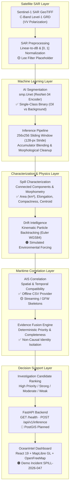

# OceanIntel — Satellite-Based Oil Spill Detection & Maritime Investigation Intelligence

> Satellite-Based Oil Spill Detection & Maritime Investigation Intelligence

**Smart India Hackathon 2026 · Problem Statement SIH26143**

---

## Overview

Marine oil pollution poses severe ecological, environmental, and economic hazards across vulnerable coastal zones and open shipping lanes. Detecting discharges and identifying candidate vessels requires overcoming complex remote sensing and hydrodynamic challenges:

- **Open-Ocean Scale & Cloud Penetration:** Cloud cover and haze routinely blind optical satellites. Synthetic Aperture Radar (SAR)—such as Sentinel-1 C-band radar—is an active microwave sensor that operates day and night, penetrating heavy cloud cover. Oil films dampen ocean capillary and short gravity waves, reducing radar backscatter and appearing as distinct dark patches ("dark spots") against rougher seawater.
- **Spatial-Temporal Decoupling:** AIS vessel tracking alone cannot pinpoint the source of a spill. By the time a satellite passes overhead (often hours or days after discharge), ocean surface currents and winds have displaced, stretched, and fragmented the slick across tens of kilometers. A vessel detected directly above a slick at satellite capture time may not have been present during discharge, while the candidate vessel present during discharge may already be far away.
- **Drift Modelling & Backtracking:** Reversing the metocean forcing through Lagrangian/kinematic particle backtracking simulates the historical trajectory of the slick backward in time, estimating the candidate release corridor and source time window.
- **What OceanIntel Combines:** OceanIntel unifies:
  $$\text{Sentinel-1 SAR} + \text{AI Segmentation} + \text{Spill Characterization} + \text{Drift Backtracking} + \text{AIS Correlation} + \text{Evidence Fusion}$$
  into an operational decision-support workstation.
- **Decision-Support Boundary:** OceanIntel produces ranked **Investigation Candidates** with deterministic **Investigation Scores** and evidence completeness metrics. OceanIntel is an investigative decision-support system; it **does not legally determine the responsible vessel** or establish regulatory culpability.

> [!IMPORTANT]
> **Attribution Language Standard:** OceanIntel generates **Investigation Candidates** (e.g., *Highest-Priority Investigation Candidate*, *Candidate Vessel*) evaluated by an **Investigation Score**. It does **NOT** identify "guilty vessels", "culprits", or "confirmed polluters". Telemetry gaps are formally designated as **AIS observation gaps** (indicating missing evidence), not proof of intentional transponder shutdown. Final attribution requires human maritime inquiry, ground-truth physical sampling, and legal verification.

---

## System Architecture



---

## Core Features

### 1. SAR Intelligence
- Ingests single-band Sentinel-1 C-band Synthetic Aperture Radar (SAR) Ground Range Detected (GRD) GeoTIFF products (primarily VV polarization).
- Converts raw linear amplitude/power values to decibels ($10 \log_{10}(x)$) and applies min-max scaling to normalize values to $[0, 1]$.
- Preserves native geospatial metadata (coordinate reference system, affine transform matrix, bounding extent, and spatial resolution).

### 2. AI Segmentation
- Implements a U-Net architecture with an ImageNet-pretrained ResNet-34 encoder via `segmentation-models-pytorch`.
- Performs single-class binary segmentation, predicting anomalous dark-spot oil slick foreground against sea-surface background.
- Employs a sliding-window inference pipeline (256×256 window, 128-pixel stride, 50% spatial overlap) with arithmetic probability accumulator blending to suppress border artifacts across full-scene satellite swaths.

### 3. Spill Characterization
- Applies morphological opening and closing filters (3×3 kernels) to remove isolated speckle false positives and bridge internal slick voids.
- Extracts individual connected slick entities via `scipy.ndimage` and `skimage.measure.regionprops`.
- Computes physical metrics: pixel area, physical surface area ($\text{km}^2$ for projected coordinate systems), perimeter ($\text{km}$), major/minor axis lengths, elongation ratio, and compactness index.
- Vectorizes detected raster masks into GeoJSON polygons using `rasterio.features.shapes`.

### 4. Drift Intelligence
- Simulates surface slick transport using a 2D kinematic particle integration model over the spherical WGS84 ellipsoid ($R_{\text{Earth}} = 6,378,137.0\text{ m}$).
- Models combined metocean transport: $\vec{v}_{\text{total}} = \vec{v}_{\text{current}} + (\alpha_{\text{windage}} \cdot \vec{v}_{\text{wind}}) + \vec{v}_{\text{diffusion}}$.
- Supports forward spreading and backward trajectory backtracking (inverting velocity vectors: $\vec{u} = -\vec{u}, \vec{v} = -\vec{v}$) to reconstruct candidate discharge corridors and estimated release windows.
- Extracts spatial quantile density envelopes and convex hull boundary polygons for maritime correlation.

### 5. AIS Maritime Intelligence
- Ingests historical vessel trajectory data via `OfflineAISProvider` from tabular CSV/in-memory records.
- Evaluates spatial compatibility between vessel trajectories and backtrack corridors using configurable perpendicular distance decay (default: 50 km search radius) with corridor intersection boosts.
- Computes temporal compatibility based on proportional observation overlap with the estimated discharge window.
- Assesses track quality, observation frequency, trajectory continuity, and corridor dwell time.

### 6. Evidence Fusion
- Deterministically fuses multi-modal indicators (spatial proximity, temporal overlap, drift alignment, vessel behavior, track quality) into a single scalar **Investigation Score**.
- Computes a separate **Evidence Completeness Score** to quantify data availability.
- Enforces non-causal identity isolation: vessel identifiers (MMSI/IMO) contribute to evidence completeness but do not inflate causal investigation priority.
- Treats missing observations explicitly as unknown evidence rather than negative evidence.

### 7. Geospatial Visualization
- Interactive maritime mapping powered by **MapLibre GL JS** with vector basemaps from **OpenFreeMap** (Liberty, Bright, and Dark themes).
- Dynamically renders GeoJSON layers for detected oil slicks, backward drift trajectory envelopes, candidate vessel routes, interactive vessel markers, and exclusion zones.
- Provides interactive measurement calipers, coordinate inspection, and layer visibility toggles.

### 8. OceanIntel Dashboard
- Built as a 13-workstation maritime operations console using React 19, TypeScript, and Vite.
- Includes Command Center, SAR Detection, Spill Intelligence, AIS Intelligence, Vessel Candidates, Evidence Matrix, Drift Modelling, Model Evaluation, Environment, Response Routes, and Dossier Reports.
- Supports direct GeoTIFF file upload to the FastAPI backend with real-time inference mask visualization.
- Features an interactive guided walkthrough mode for operational incident review.

---

## Implementation Status

| Component | Status | Details |
|---|---|---|
| **SAR Preprocessing** | 🟡 Prototype / Partial | Linear-to-dB conversion and $[0, 1]$ normalization implemented; `apply_lee_filter` is a placeholder returning raw arrays; radiometric calibration and terrain correction are not implemented. |
| **AI Segmentation** | ✅ Implemented | ResNet-34 U-Net binary segmentation (`classes=1`) implemented in PyTorch with Albumentations augmentations. |
| **Model Training** | ✅ Implemented | Training loop with dynamic positive-class weighting and scene-aware splitter implemented; trained for 5 epochs on Gulf of Mexico dataset. Checkpoints are not committed to git. |
| **Spill Characterization** | ✅ Implemented | Connected component labeling, area ($\text{km}^2$), perimeter, elongation, compactness, centroid, and GeoJSON polygon extraction implemented. |
| **Drift Modelling** | 🟠 Demo / Simulated | 2D kinematic Euler particle tracking with windage and diffusion implemented; currently driven by synthetic environmental fixtures (`SyntheticConstantEnv`, `SyntheticVariableEnv`). Real CMEMS/ERA5 integration is planned. |
| **AIS Correlation** | 🟡 Prototype / Partial | `OfflineAISProvider` (CSV/in-memory) and scoring logic implemented; `AISStreamProvider` (WebSocket) and `GFWProvider` (REST) are skeleton stubs. |
| **Evidence Engine** | ✅ Implemented | Deterministic evidence fusion, evidence completeness scoring, non-causal identity isolation, and classification boundaries fully implemented. |
| **FastAPI Backend** | ✅ Implemented | FastAPI application with `GET /health` and `POST /api/v1/inference` for GeoTIFF raster processing. |
| **Map Visualization** | ✅ Implemented | MapLibre GL JS with OpenFreeMap vector tile basemaps (Liberty/Bright/Dark); renders GeoJSON layers and vessel tracks. Google Maps is not active or configured. |
| **React Dashboard** | ✅ Implemented | 13 functional workstations in React 19 + TypeScript; includes demo store and live SAR inference upload integration. |
| **Real-World Validation** | 🟡 Prototype / Partial | Offline validation conducted on 7 held-out Gulf of Mexico SAR scenes; end-to-end operational validation with concurrent real SAR + real AIS + real ocean currents is pending. |

---

## Machine Learning Pipeline

### Actual Architecture & Specification

| Parameter | Repository Implementation |
|---|---|
| **Model Framework** | PyTorch (`torch` >= 2.9.0) / `segmentation-models-pytorch` (`smp.Unet`) |
| **Encoder Backbone** | ResNet-34 (`resnet34`), pre-trained on ImageNet |
| **Input Channels** | **1** (Single-channel SAR VV backscatter amplitude/dB) |
| **Output Classes** | **1** (Binary segmentation: Oil Spill foreground vs. Ocean background) |
| **Final Activation** | Sigmoid (`torch.sigmoid(logits) > 0.5`) |
| **Loss Function** | `torch.nn.BCEWithLogitsLoss` with positive class weighting |
| **Class Weighting** | Dynamic `pos_weight` (~34.89 calculated on Gulf of Mexico training set) |
| **Optimizer** | AdamW (`lr=1e-4`) |
| **Input Resolution** | 256 × 256 pixels |
| **Augmentation** | `HorizontalFlip(p=0.5)`, `VerticalFlip(p=0.5)`, `RandomRotate90(p=0.5)`, `ToTensorV2()` |
| **Model Weights** | **Trained model weights are not included in the current repository.** Checkpoints are generated via `create_dummy_model.py` (initialization) or `train.py` (training). |

> [!IMPORTANT]
> **Binary Segmentation Only:**
> Current implementation uses **binary segmentation** (`classes=1`). The model detects anomalous oil slick backscatter against ocean background. Multi-class 5-class segmentation (distinguishing oil slicks, look-alikes, vessels, land, and sea surface) was explored in early project design documents and dataset audits, but is **planned for future iterations** and is not currently implemented in the codebase.

### Training Configuration
The training routine in `model_repo/src/models/train.py` executes:
- **Scene-Aware Data Split:** Grouped by parent SAR scene ID via `model_repo/src/data/splitter.py` to prevent spatial patch autocorrelation and data leakage across overlapping chips.
- **Optimization:** AdamW with learning rate $1 \times 10^{-4}$ for 5 epochs with batch size 32.
- **Dynamic Imbalance Handling:** Estimates positive-to-negative pixel ratio across training patches to set `pos_weight` in `BCEWithLogitsLoss`.

### Reported Evaluation Results
Trained on the Gulf of Mexico Sentinel-1 SAR dataset (`model_repo/reports/stage2_results.json`):

#### Validation Performance (Best: Epoch 4)
- **Validation Dice / F1:** 0.6963
- **Validation IoU:** 0.5417
- **Validation Precision:** 0.5435
- **Validation Recall:** 0.9899
- **Validation Loss:** 0.1034

#### Held-Out Test Scene Evaluation (Overall)
Evaluated across 7 completely held-out full SAR scenes using non-overlapping 256×256 evaluation grids:
- **Overall Test Dice:** 0.3980
- **Overall Test IoU:** 0.3128
- **Overall Test Precision:** 0.3357
- **Overall Test Recall:** 0.5642

#### Per-Scene Test Variation
| Test Scene File | Dice | IoU | Precision | Recall |
|---|:---:|:---:|:---:|:---:|
| `2018_09_26.tif` | 0.2344 | 0.1750 | 0.2128 | 0.2962 |
| `2018_12_19_d.tif` | **0.7504** | **0.6011** | 0.6095 | 0.9762 |
| `2018_12_19_e.tif` | 0.4403 | 0.3433 | 0.3443 | 0.6219 |
| `2018_12_19_f_.tif` | 0.4223 | 0.3633 | 0.3724 | 0.6893 |
| `20191015.tif` | 0.2576 | 0.1709 | 0.1744 | 0.5906 |
| `20200224_b.tif` | 0.1878 | 0.1504 | 0.2198 | 0.1639 |
| `20200319b.tif` | 0.4932 | 0.3855 | 0.4166 | 0.6117 |

> [!NOTE]
> **Generalization Gap:** Test IoU varies from 0.1504 to 0.6011 across individual scenes, with an overall held-out IoU of 0.3128 compared to validation IoU of 0.5417. This variance reflects the sensitivity of SAR backscatter to local wind speed, sea state, look-alike presence, and radar incidence angles.

---

## Dataset & Data Strategy

Raw dataset rasters are not committed directly to the git repository due to file size constraints. Data management is partitioned as follows:

### Real Data
- **Gulf of Mexico Sentinel-1 SAR Dataset:** Zenodo Record [4672426](https://zenodo.org/records/4672426) (`Radar_data.rar`). Used for Phase 1 model training and held-out scene testing. Download script provided at `model_repo/scripts/data_acquisition/download_gom.py`.
- **Trujillo Sentinel-1 SAR Oil Spill Dataset:** Zenodo Record [8208466](https://zenodo.org/record/8208466). Analyzed in `model_repo/docs/DATASET_AUDIT.md`; download script located at `model_repo/scripts/data_acquisition/download_trujillo.py`.
- **Peruvian Coastal SAR Oil Spill Segmentation Dataset:** Evaluated as an academic case study reference (Ventanilla spill, January 2022; IEEE DataPort). Not currently integrated into model training.

### Synthetic Data
- **Synthetic Test Masks:** Deterministic NumPy arrays in `model_repo/tests/fixtures/synthetic_masks.py` defining geometric slick masks (compact circles, elongated streaks, fragmented patches) used for automated unit testing of characterization and drift modules.

### Mock & Demo Data
- **Persian Gulf Demo Incident (`SPILL-2026-047`):** Centralized demonstration dataset located at `src/data/demo/incident.ts`. Provides mock coordinates (`26.15°N, 51.80°E`), simulated metocean conditions, synthetic drift envelopes, and 4 simulated candidate vessel tracks (`MT ARGO GLORY`, `PACIFIC HORIZON`, `SEA BRAVERY`, `AL-BARAKA 9`).
- **Historical Demo Archive:** Additional simulated incidents in `src/data/demo/historical.ts` for frontend workstation demonstration.

---

## SAR Preprocessing

Implementation in `model_repo/src/preprocessing/sar_prep.py`:

- **Decibel Conversion:** Converts linear SAR backscatter values to decibels via $10 \log_{10}(\max(x, 10^{-10}))$.
- **Clipping:** Clamps decibel values to a defined dynamic range (default: `db_min = -45.0` to `db_max = 20.0 dB`, or `-30.0` to `0.0 dB`).
- **Normalization:** Min-max scales clipped dB values to $[0, 1]$:
  $$\hat{x} = \frac{x_{\text{dB}} - \text{db\_min}}{\text{db\_max} - \text{db\_min}}$$
- **NaN / Infinity Handling:** Replaces `NaN` and `+Inf`/`-Inf` values with `db_min` via `np.nan_to_num`.
- **Speckle Filtering:** 🟡 `apply_lee_filter()` is **currently implemented as a placeholder** that returns the input array unmodified.
- **Calibration & Terrain Correction:** No radiometric calibration (converting digital numbers to $\sigma^0$) or Range-Doppler terrain correction is performed in code. Input GeoTIFFs are assumed to be pre-calibrated Sentinel-1 Level-1 Ground Range Detected (GRD) products.
- **Geospatial Handling:** Raster extraction uses `rasterio` windowed reading with boundless padding (`fill_value = db_min`).

---

## Inference Pipeline

Implementation in `model_repo/src/inference/pipeline.py`:

```
Input GeoTIFF (Single-Band SAR)
   │
   ▼
Window Partitioning (256×256 pixels, stride 128, boundless reading)
   │
   ▼
Normalization (NaN replacement, dB clipping, [0, 1] scaling)
   │
   ▼
Batch Tensor Assembly (Batch size: 16)
   │
   ▼
Model Forward Pass (ResNet-34 U-Net → Sigmoid probabilities)
   │
   ▼
Probability Accumulation & Arithmetic Averaging (prob_acc / count_acc)
   │
   ▼
Threshold Binarization (threshold ≥ 0.5)
   │
   ▼
Morphological Cleanup (Opening 3×3 → Closing 3×3 → Filter components < 10 px)
   │
   ▼
Object Extraction & Vectorization (Centroids, Area, Bounding Boxes, GeoJSON)
   │
   ▼
Output Export (Georeferenced GeoTIFF Mask + Structured JSON Result)
```

1. **Tile Extraction:** The full scene is divided into overlapping 256×256 pixel tiles with a 128-pixel stride (50% spatial overlap). Boundless reading handles raster boundaries.
2. **Batched Forward Pass:** Tiles are batched (default batch size: 16) and evaluated on CUDA (or CPU fallback) using sigmoid activation.
3. **Accumulator Blending:** Predictions are accumulated into a floating-point probability map and an integer observation counter grid, then normalized by arithmetic division (`prob_acc / count_acc`).
4. **Binarization:** Evaluated against a classification threshold (default `0.5`).
5. **Morphological Filtering:** Morphological opening (3×3 kernel) removes single-pixel noise; morphological closing (3×3 kernel) bridges interior voids; connected components smaller than 10 pixels are discarded.
6. **Object Extraction:** Distinct slicks are labeled via `skimage.measure.label`, and bounding boxes, centroids, and areas are computed.
7. **Vector & Raster Output:** Generates a georeferenced output mask GeoTIFF preserving source CRS and affine transform, and converts slick contours to GeoJSON polygons via `rasterio.features.shapes`.

---

## Spill Characterization

Implementation in `model_repo/src/characterization/object_extraction.py` and `geospatial.py`:

- **Connected Component Extraction:** Identifies discrete slick entities using `skimage.measure.regionprops`.
- **Surface Area:**
  - If CRS is projected (units in meters, e.g., UTM): $\text{Area} (\text{km}^2) = \text{Pixel Count} \times |X_{\text{res}}| \times |Y_{\text{res}}| / 10^6$.
  - If CRS is geographic (degrees): Area calculation in $\text{km}^2$ returns `None` to prevent metric distortion without reprojection.
- **Geographic Centroid:** Pixel row/column centroids converted to geographic coordinates using the rasterio affine transform:
  $$\text{Lon} = c + a \cdot \text{col} + b \cdot \text{row}, \quad \text{Lat} = f + d \cdot \text{col} + e \cdot \text{row}$$
  Reprojected to EPSG:4326 for downstream interoperability.
- **Elongation:** Ratio of the major ellipse axis length to the minor ellipse axis length:
  $$\text{Elongation} = \frac{\text{Major Axis Length}}{\text{Minor Axis Length}}$$
- **Compactness Index:** Isoperimetric quotient measuring circularity:
  $$\text{Compactness} = \frac{4 \pi \times \text{Area}}{\text{Perimeter}^2}$$
  (Values near 1.0 indicate circular features such as biogenic slicks; lower values indicate elongated, linear discharges typical of vessel spills).
- **Orientation:** Major axis orientation angle in degrees ($[-90^\circ, +90^\circ]$).
- **Severity & Uncertainty Annotations:** The `SpillDetection` data schema tracks explicit uncertainty flags for model confidence, segmentation uncertainty, geolocation certainty, and attribution confidence.

---

## Drift Intelligence

Implementation in `model_repo/src/drift/`:

### Transport Physics
Particle displacement is integrated using 2D Euler time-stepping over a spherical Earth model ($R_{\text{Earth}} = 6,378,137.0\text{ m}$):

$$\vec{v}_{\text{total}} = \vec{v}_{\text{current}} + (\alpha_{\text{windage}} \cdot \vec{v}_{\text{wind}}) + \vec{v}_{\text{diffusion}}$$

- **Euler Step:** Converts velocity $(\text{m/s})$ to angular coordinates:
  $$\Delta \text{Lat} = \frac{v \cdot \Delta t}{R_{\text{Earth}}}, \quad \Delta \text{Lon} = \frac{u \cdot \Delta t}{R_{\text{Earth}} \cdot \cos(\text{Lat})}$$
- **Windage Factor ($\alpha$):** Sampled uniformly per particle: $\alpha \sim U(0.01, 0.04)$ (1% to 4% windage).
- **Turbulent Diffusion:** Simulated as a Gaussian random velocity perturbation scaled by `diffusion_coef_m2_s`.

### Trajectory Backtracking
- **Reverse Integration:** Inverts velocity vectors ($\vec{u} = -\vec{u}, \vec{v} = -\vec{v}$) and steps backward in time from the satellite observation timestamp to the estimated discharge window.
- **Particle Seeding:** Particles are initialized uniformly within the slick geometry via bounding-box rejection sampling.
- **Corridor Reconstruction:** Backtracked particle clouds are aggregated into 2D histogram quantile density grids to delineate origin likelihood corridors and convex hull boundary polygons.

### Environmental Forcing Separation
- **SIMULATED ENVIRONMENTAL FORCING:** The drift module operates as a **stochastic/kinematic prototype** driven by synthetic test fixtures (`SyntheticConstantEnv`, `SyntheticVariableEnv`).
- **REAL ENVIRONMENTAL DATA:** Not currently connected.
- **PLANNED INTEGRATION:** Real-time and historical integration with Copernicus Marine Service (CMEMS) hydrodynamic ocean currents, ECMWF ERA5 atmospheric wind reanalysis, HYCOM, and INCOIS is architecturally defined via `BaseEnvironmentalAdapter` but **not yet connected**.
- **Notice:** OceanIntel does not claim operational oceanographic forecasting capability at this prototype stage.

---

## AIS Maritime Intelligence

Implementation in `model_repo/src/ais/`:

### Ingestion & Track Processing
- **Offline Trajectory Loading:** `OfflineAISProvider` parses historical vessel position reports, timestamps, MMSI/IMO identifiers, vessel dimensions, and speed/course from tabular CSV and in-memory sources.
- **Track Segmentation:** Segments raw AIS feeds into continuous voyages based on temporal threshold breaks.

### Compatibility Evaluation
- **Spatial Compatibility:** Evaluates the minimum perpendicular distance from a vessel's trajectory to the drift backtrack corridor. Uses linear distance decay over a configurable search radius (default: 50 km) with a +0.2 additive boost for trajectories that physically intersect the corridor polygon.
- **Temporal Compatibility:** Evaluates the proportional overlap between a vessel's observation window and the backtracking origin time window:
  $$\text{Score}_{\text{temporal}} = \min\left(1.0, \frac{\text{Temporal Overlap (seconds)}}{\text{Source Window Duration (seconds)}}\right)$$
- **Track Quality Score:** Assesses observation count (minimum threshold: 3 observations) and penalizes excessive gaps relative to track duration.
- **Behavioral Consistency:** Assesses course stability, corridor dwell time, and speed profile consistency.

### AIS Observation Gaps
- Telemetry interruptions are formally classified as an **AIS observation gap** rather than "AIS disabled" or "dark vessel".
- An AIS observation gap represents **missing evidence**, not proof of deliberate transponder shutdown. Terrestrial terrain shadowing, satellite revisit latency, and radio frequency interference in dense shipping lanes frequently cause gaps in legitimate vessel transmissions.
- Real historical AIS streaming (`AISStreamProvider` via WebSocket) and external REST queries (`GFWProvider` via Global Fishing Watch) are skeleton adapter classes and raise unsupported capability exceptions in the current prototype.

---

## Evidence Fusion & Investigation Ranking

Implementation in `model_repo/src/evidence/`:

### Deterministic Multi-Modal Fusion
The evidence fusion engine computes an **Investigation Score** (scalar in $[0, 1]$) and an **Evidence Completeness Score** (scalar in $[0, 1]$):

$$\text{Investigation Score} = \frac{\sum_{i} w_i \cdot s_i \cdot r_i}{\sum_{i} w_i \cdot r_i}, \quad \text{Completeness} = \frac{\sum_{i} w_i \cdot a_i}{\sum_{i} w_i}$$

| Evidence Item | Weight ($w_i$) | Reliability Prior ($r_i$) | Direction | Description |
|---|:---:|:---:|:---:|---|
| **Drift Compatibility** | 0.35 | 0.80 | Supporting / Contradicting | Spatial alignment with particle drift corridor |
| **Temporal Compatibility** | 0.25 | 0.90 | Supporting / Neutral | Overlap with estimated release time window |
| **Spatial Proximity** | 0.20 | 0.90 | Supporting / Neutral | Distance decay to backtrack corridor |
| **Vessel Behavior** | 0.10 | 0.70 | Supporting / Neutral | Speed profile, dwell time, and route continuity |
| **Track Quality** | 0.10 | 1.00 | Supporting / Contradicting | Observation density and gap duration |
| **Vessel Identity** | 0.00* | — | Neutral | Metadata completeness only (MMSI: 0.5, IMO: 1.0) |

*\*Vessel identity (MMSI/IMO) carries a causal weight of 0.00 and does not inflate the Investigation Score. It contributes exclusively to the Evidence Completeness Score.*

### Non-Causal Principles & Missing Evidence
- **Missing Evidence is Not Negative Evidence:** If an evidence factor is unavailable (e.g., no wind data, missing speed record), its availability flag $a_i$ is set to 0. It does not penalize the score to zero; instead, weights are normalized across observed evidence factors.
- **Identity is Not Causality:** Having a confirmed vessel name, MMSI, or IMO number does not increase the likelihood that a vessel caused a discharge; it only indicates higher record completeness.
- **Deterministic Metric:** The score is an **Investigation Score** reflecting heuristic engineering weights, not a calibrated legal probability or likelihood of guilt.
- **Candidate Classifications:**
  - `HIGH_PRIORITY_INVESTIGATION_CANDIDATE` ($\ge 0.80$)
  - `STRONGLY_COMPATIBLE` ($\ge 0.65$)
  - `MODERATELY_COMPATIBLE` ($\ge 0.45$)
  - `WEAKLY_COMPATIBLE` ($\ge 0.25$)
  - `INSUFFICIENT_EVIDENCE` ($\ge 0.10$)
  - `NO_EVIDENCE` ($< 0.10$)

---

## Map Visualization

- **Active Map Engine:** The OceanIntel frontend utilizes **MapLibre GL JS** (`maplibre-gl` ^6.8.0) as its active map visualization engine.
- **Vector Basemap Provider:** Consumes vector tiles from **OpenFreeMap** with support for three selectable themes:
  - Liberty: `https://tiles.openfreemap.org/styles/liberty` (Default high-visibility maritime theme)
  - Bright: `https://tiles.openfreemap.org/styles/bright`
  - Dark: `https://tiles.openfreemap.org/styles/dark`
- **Rendered Geospatial Layers:**
  - Detected oil slick boundary polygons (`spill-src`, GeoJSON polygon)
  - Backward drift simulation envelopes and origin corridors (`drift-src`, GeoJSON polygon)
  - Candidate vessel historical tracks (`ais-tracks-src`, GeoJSON line strings)
  - Vessel position markers with heading vectors and priority status colors
  - Simulated look-alike zones and environmental exclusion boundaries
- **Google Maps Status:** The active map engine is MapLibre GL and OpenFreeMap. Google Maps is **not active or configured** in the frontend source code. If Google mapping APIs are configured in future phases, credentials must be supplied via environment variables (`VITE_GOOGLE_MAPS_API_KEY`). Never expose API keys in code or documentation.

---

## OceanIntel Dashboard

The frontend is a single-page application built with React 19, TypeScript, and Vite.

### Workstation Pages

| Page | Path / Nav ID | Description |
|---|---|---|
| **Command Center** | `command-center` | Operational mission control overview with incident metrics, priority alert banners, live Indian Standard Time (IST) clock, and an interactive guided investigation launcher. |
| **Investigations** | `investigations` | Incident ledger tracking open, pending, and resolved maritime cases. |
| **SAR Detection** | `sar-detection` | Dual-pane satellite viewer comparing raw SAR amplitude, calibrated dB backscatter heatmaps, AI segmentation masks, and look-alike filters. |
| **Spill Intelligence** | `spill-intelligence` | Morphological geometry analysis, orientation calipers, and a **live GeoTIFF file upload widget** wired directly to `POST /api/v1/inference`. |
| **AIS Intelligence** | `ais-intelligence` | Vessel trajectory viewer, corridor interaction inspector, and telemetry density monitor. |
| **Vessel Candidates** | `vessel-candidates` | Ranked candidate vessel table with score component breakdowns and candidate inspection drawers. |
| **Evidence** | `evidence` | Deterministic evidence fusion breakdown, weight sensitivity views, and timeline correlation. |
| **Historical Intelligence** | `historical-intelligence` | Geospatial incident archive and historical spill records. |
| **Drift Modelling** | `drift` | 2D particle simulation display showing trajectory cones, coastal impact envelopes, and forcing vectors. |
| **Model Evaluation** | `model-evaluation` | ML architecture specification, per-scene held-out evaluation benchmarks, and sea state robustness analysis. |
| **Environment** | `environment` | Metocean forcing viewer (surface current vectors, wind speed/direction, sea state). |
| **Response Routes** | `response-routes` | Contingency containment logistics, patrol vessel routing, and equipment deployment envelopes. |
| **Reports** | `reports` | Automated investigation dossier generator with summary export capabilities. |

### Data Modes in Dashboard
- **Demo Mode:** Displays the explicit badge `DEMO MODE · SIMULATED DATA` across simulated views.
- **Live Mode:** Uploading a GeoTIFF in Spill Intelligence switches the status badge to `LIVE · SAR INFERENCE`, displaying real-time detection counts, bounding boxes, and extracted geometries from the FastAPI backend.

---

## Backend API

The backend is built with FastAPI and is located at `model_repo/src/api/main.py`.

### Endpoints

| Method | Endpoint | Purpose |
|---|---|---|
| `GET` | `/health` | Service health status check |
| `POST` | `/api/v1/inference` | Executes full-scene SAR segmentation and characterization on an uploaded GeoTIFF |

### `POST /api/v1/inference` Response Schema

```json
{
  "status": "success",
  "source": {
    "filename": "2018_09_26.tif",
    "width": 3824,
    "height": 4120,
    "crs": "EPSG:32616",
    "bands": 1
  },
  "model": {
    "checkpoint": "models/best_model.pth",
    "architecture": "resnet34 U-Net",
    "input_channels": 1
  },
  "inference": {
    "tile_size": 256,
    "stride": 128,
    "threshold": 0.5,
    "device": "cuda"
  },
  "detection": {
    "oil_spill_detected": true,
    "object_count": 42
  },
  "objects": [
    {
      "id": 1,
      "confidence_mean": 0.874,
      "confidence_max": 0.992,
      "area_km2": 4.12,
      "centroid": {
        "longitude": 51.8021,
        "latitude": 26.1543
      },
      "bbox": {
        "min_lon": 51.7890,
        "min_lat": 26.1420,
        "max_lon": 51.8150,
        "max_lat": 26.1660
      },
      "label_id": 1
    }
  ],
  "output_mask": "data/processed/inference_outputs/2018_09_26_mask.tif"
}
```

---

## Geospatial Data Layer

- **Current Implementation:** Geospatial operations are executed in-memory using `rasterio` (windowed I/O and affine math), `shapely` (geometry predicates and bounding boxes), `pyproj` (coordinate reprojection), and `geopandas`. Output artifacts are saved to local filesystem directories as GeoTIFF, GeoJSON, and CSV files.
- **PostGIS / PostgreSQL Status:** **Planned but NOT implemented.** No relational database connection, ORM models, or spatial SQL queries exist in the current codebase.

---

## Repository Structure

```
oil-spill/
├── index.html                   # Frontend HTML entry point
├── package.json                 # Node dependencies, scripts, dev:full runner
├── tsconfig.json                # TypeScript compiler configuration
├── vite.config.ts               # Vite bundler & backend API proxy configuration
├── public/                      # Static assets and favicons
├── src/                         # Frontend Application (React 19 + TypeScript)
│   ├── main.tsx                 # React DOM mount point
│   ├── App.tsx                  # Root shell, navigation state, and IST clock
│   ├── components/              # Reusable UI, MapLibre GL, and navigation components
│   │   ├── common/              # Status badges (DataStatusBadge) and KPI cards
│   │   ├── investigation/       # GuidedWalkthrough multi-step workflow
│   │   ├── map/                 # MapLibreMap vector basemap and controls
│   │   ├── navigation/          # Sidebar navigation and header shell
│   │   └── ui/                  # Buttons, cards, modals, tables, tabs
│   ├── context/                 # Application context (ThemeContext)
│   ├── data/demo/               # Centralized simulated demonstration store
│   │   ├── incident.ts          # Demo incident SPILL-2026-047 (Persian Gulf)
│   │   └── historical.ts        # Historical demonstration incidents
│   ├── pages/                   # 13 Workstation page views
│   │   ├── CommandCenter/       # Operational mission control
│   │   ├── Investigations/      # Incident tracking & management
│   │   ├── SarDetection/        # SAR satellite inspection workstation
│   │   ├── SpillIntelligence/   # Geometric analysis & live GeoTIFF upload
│   │   ├── AisIntelligence/     # Maritime tracking & vessel trajectories
│   │   ├── VesselCandidates/    # Ranked candidate vessel inspection list
│   │   ├── Evidence/            # Deterministic evidence fusion matrix
│   │   ├── HistoricalIntelligence/ # Incident history & geospatial archive
│   │   ├── DriftModelling/      # Particle drift simulation & envelopes
│   │   ├── ModelEvaluation/     # ML architecture & evaluation metrics
│   │   ├── Environment/         # Metocean conditions viewer
│   │   ├── ResponseRoutes/      # Contingency logistics & vessel routing
│   │   └── Reports/             # Dossier generation & export
│   ├── services/                # HTTP client calling FastAPI backend (/api/v1/inference)
│   ├── styles/                  # Design tokens, typography, surfaces, reset
│   └── utils/                   # GeoJSON adapters and formatters
└── model_repo/                  # Backend & ML Core (Python)
    ├── pyproject.toml           # Python package dependencies & build metadata
    ├── create_dummy_model.py    # Generates initialized model checkpoint
    ├── .env.example             # Template for environment variables (no secrets)
    ├── configs/                 # YAML configuration files
    │   ├── inference_config.yaml # Inference tile, stride, threshold, and paths
    │   ├── stage3_config.yaml   # Characterization thresholds
    │   ├── stage4_config.yaml   # Drift model parameters
    │   ├── stage5_config.yaml   # AIS correlation weights and search radii
    │   └── stage6_config.yaml   # Evidence fusion weights and thresholds
    ├── docs/                    # Architectural audits and dataset evaluations
    │   └── DATASET_AUDIT.md     # In-depth SAR dataset audit
    ├── reports/                 # Persistent evaluation metrics
    │   └── stage2_results.json  # Gulf of Mexico training history & test results
    ├── scripts/                 # CLI execution pipelines and data acquisition
    │   ├── data_acquisition/    # Download scripts for Gulf of Mexico & Trujillo
    │   ├── run_e2e_pipeline.py  # End-to-end command-line attribution pipeline
    │   ├── smoke_test_inference.py # Quick inference validation script
    │   └── verify_environment.py # Environment and dependency check script
    ├── src/                     # Backend Python source modules
    │   ├── ais/                 # AIS normalization, providers, scoring, schemas
    │   ├── api/                 # FastAPI application (`main:app`)
    │   ├── characterization/    # Morphological processing, geometry, schemas
    │   ├── data/                # PyTorch Dataset loaders & scene-aware splitter
    │   ├── drift/               # Kinematic particle physics, environment, simulation
    │   ├── evaluation/          # Segmentation metric calculation
    │   ├── evidence/            # Multi-modal fusion, classification, explanation
    │   ├── inference/           # Tiled sliding-window SAR inference pipeline
    │   ├── models/              # ResNet-34 U-Net definition & training loop
    │   ├── preprocessing/       # SAR linear-to-dB scaling & normalization
    │   └── utils/               # Pipeline data adapters
    └── tests/                   # Automated test suite (~67 tests)
        ├── fixtures/            # Synthetic masks and raster generators
        ├── unit/                # Unit tests for AIS, drift, ML, characterization
        └── integration/         # Multi-stage pipeline integration tests
```

---

## Installation

### Prerequisites
- **Operating System:** Linux, macOS, or Windows
- **Python:** 3.11+
- **Node.js:** 18.0+
- **GPU (Optional):** NVIDIA GPU with CUDA for accelerated PyTorch inference (CPU execution is fully supported)

### 1. Frontend Setup
```bash
# In repository root
npm install
```

### 2. Backend Setup
```bash
# Navigate to backend directory
cd "model_repo"

# Create virtual environment
python -m venv venv

# Activate virtual environment
# Windows (PowerShell):
.\venv\Scripts\activate
# Linux / macOS:
source venv/bin/activate

# Install PyTorch with appropriate compute platform (adjust CUDA version if needed)
pip install torch torchvision --index-url https://download.pytorch.org/whl/cu121

# Install repository package with development dependencies
pip install -e ".[dev]"
```

### 3. Model Checkpoint Initialization
Trained model weights are not committed to git. To initialize a baseline checkpoint for pipeline execution:
```bash
cd model_repo
python create_dummy_model.py
cd ..
```
*This generates `model_repo/models/best_model.pth` with ImageNet-initialized ResNet-34 U-Net weights.*

### 4. Database Setup
No database installation is required for the current prototype. State is handled in-memory and via local filesystem artifacts.

### 5. Environment Variables
Copy the template in `model_repo/.env.example` to create a local `.env` file:
```bash
cd model_repo
cp .env.example .env
```
Key configuration variables:
- `PROJECT_NAME`: Project identifier (`sih26143-oil-spill`)
- `ENVIRONMENT`: Runtime mode (`development` / `production`)
- `BACKEND_HOST`: Server binding address (`127.0.0.1` or `0.0.0.0`)
- `BACKEND_PORT`: Server port (`8000`)
- `COPERNICUS_USERNAME` / `COPERNICUS_PASSWORD`: Optional Copernicus Data Space credentials for satellite retrieval
- `AISSTREAM_API_KEY`: Optional key for live AISStream WebSocket testing
- `GFW_API_KEY`: Optional key for Global Fishing Watch API queries

> [!CAUTION]
> **Security Rule:** Never commit `.env` files, API keys, or credentials to version control.

---

## Running OceanIntel

OceanIntel provides verified scripts in `package.json`:

### Option A: Concurrent Full Stack (Recommended)
From the repository root, start both the FastAPI backend and Vite frontend concurrently:
```bash
npm run dev:full
```

### Option B: Running Services Individually

**Backend API:**
```bash
npm run backend
```
*(Runs: `cd model_repo && .\venv\Scripts\activate && uvicorn src.api.main:app --host 127.0.0.1 --port 8000 --reload`)*

**Frontend Dev Server:**
```bash
npm run dev
```

### What You Will See
- The Vite development server starts at [http://localhost:5173/](http://localhost:5173/).
- Opening the URL displays the **Command Center** workstation with active incident metrics, live Indian Standard Time (IST) clock, interactive MapLibre GL map, and navigation sidebar.
- Navigating to **Spill Intelligence** allows testing live inference: drag and drop any single-band SAR GeoTIFF (`.tif` / `.tiff`) into the upload zone to trigger the backend segmentation pipeline and view the resulting mask.

### Command-Line End-to-End Pipeline
To run the full detection, characterization, drift, and AIS correlation pipeline directly via CLI:
```bash
cd model_repo
python scripts/run_e2e_pipeline.py --input path/to/sar_scene.tif --timestamp 2026-03-10T14:30:00
```

---

## Demo Mode

> DEMO MODE · SIMULATED DATA

The frontend runs in **Demo Mode** by default to enable full evaluation of the user interface without requiring continuous live satellite or AIS feeds:

| Parameter | Demonstration Fixture (`SPILL-2026-047`) |
|---|---|
| **Incident ID** | `SPILL-2026-047` |
| **Geographic Location** | Central Persian Gulf (`26.15°N, 51.80°E`), ~42 km offshore |
| **Simulated Slick Dimensions** | Estimated area: 18.4 $\text{km}^2$, length: 14.2 km, width: 2.1 km |
| **Simulated Ocean Current** | 0.75 knots at 135° (South-East) |
| **Simulated Wind Forcing** | 12.4 knots at 310° (North-West) |
| **Simulated Candidate Vessels** | 4 vessels: `MT ARGO GLORY` (Crude Tanker), `PACIFIC HORIZON` (Container), `SEA BRAVERY` (Bulk Carrier), `AL-BARAKA 9` (Bunkering Tanker) |

### Live Data vs. Demo Data Separation
- Every UI card, map header, and table displaying mock data shows the yellow badge: `DEMO MODE · SIMULATED DATA`.
- When an operator uploads a real SAR GeoTIFF via the Spill Intelligence panel, the view switches to the green badge: `LIVE · SAR INFERENCE`, rendering the actual extracted bounding boxes and calculated metrics returned by the FastAPI inference endpoint.
- Simulated vessel tracks, slick values, and environmental vectors are strictly demo representations and must **never** be presented as real-world satellite observations.

---

## Testing

### Framework & Execution
Tests are implemented with `pytest` and reside in `model_repo/tests/`.

```bash
cd model_repo
pytest
```

### Verified Test Suite
During repository auditing, **46 automated tests passed** across the unit and integration test suites (~67 total test functions present):

- **Unit Tests (`tests/unit/`):**
  - `test_ml_infrastructure.py`: Validates U-Net tensor shapes, loss and metric calculations, and scene-aware splitter logic.
  - `test_stage2.py`: Validates dataset patch extraction, linear-to-dB conversion, NaN handling, and model forward pass.
  - `test_inference.py`: Validates sliding-window slicing, probability accumulator math, border boundless padding, and morphological thresholding.
  - `test_characterization.py`: Validates physical area calculations, perimeter conversions, elongation math, compactness index, and GeoJSON polygon generation.
  - `test_drift.py`: Validates 2D kinematic Euler transport, spherical Earth distance steps, particle beaching logic, windage sampling, and velocity inversion during backtracking.
  - `test_ais.py`: Validates AIS trajectory normalization, spatial distance decay, temporal overlap calculation, and behavior scoring.
  - `test_evidence.py`: Validates deterministic evidence fusion math, contradiction handling, missing evidence normalization, and candidate classification thresholds.
- **Integration Tests (`tests/integration/`):**
  - `test_stage3_pipeline.py` through `test_stage8_pipeline.py`: Validates multi-stage end-to-end data flow from SAR input to candidate ranking.

> [!NOTE]
> **Engineering Validation vs. Real-World Accuracy:** Passing tests confirm deterministic software correctness, mathematical transformation integrity, and pipeline data contracts on synthetic fixtures. They do **not** prove real-world detection accuracy across complex marine environments.

---

## Scientific & Engineering Limitations

1. **Model Weights Not Committed:** Pre-trained model weights are not hosted in the git repository. Users must train a checkpoint using `train.py` or run `create_dummy_model.py` for initialization.
2. **Binary vs. Multi-Class Segmentation:** The current model performs single-class binary segmentation (oil slick vs. ocean background). It does not classify oil types (crude vs. diesel) or segment look-alikes, ships, and land at the pixel level.
3. **Preprocessing Placeholders:** `apply_lee_filter()` is currently a placeholder returning unmodified arrays. Full radiometric calibration and Range-Doppler terrain correction are not implemented.
4. **Simulated Environmental Forcing:** The drift module operates as a kinematic prototype driven by synthetic fixtures (`SyntheticConstantEnv`, `SyntheticVariableEnv`). Live or historical CMEMS ocean currents and ERA5 winds are not yet connected.
5. **AIS Provider Limitations:** Only `OfflineAISProvider` (CSV/in-memory) is functional. `AISStreamProvider` (WebSocket) and `GFWProvider` (REST) are skeleton adapters.
6. **Geographic Generalization:** The model was trained on Sentinel-1 data from the Gulf of Mexico. Performance on Indian coastal waters (Arabian Sea, Bay of Bengal) has not been independently validated.
7. **Look-Alike Vulnerability:** SAR dark spots are caused by any surface tension damping, including low-wind areas (< 3 m/s), biogenic slicks (algal blooms), internal ocean waves, and grease ice. Without auxiliary metocean gating, dark-spot false alarms can occur.
8. **Uncalibrated Priority Scores:** Investigation Scores represent deterministic rankings based on heuristic engineering weights; they are not calibrated Bayesian posterior probabilities.
9. **No Persistent Spatial Database:** PostGIS/PostgreSQL is planned but not implemented. Incident states are stored in memory or JSON files.
10. **UI Demo Data Reliance:** Most workstation views operate on the simulated Persian Gulf dataset (`SPILL-2026-047`) unless a GeoTIFF is explicitly uploaded.

---

## Responsible Use

OceanIntel is engineered exclusively as a **decision-support and investigative intelligence system**.

- **No Legal Attribution:** A high Investigation Score indicates spatial-temporal compatibility with an estimated backward drift corridor; it does **not** establish legal guilt or prove discharge.
- **AIS Observation Gaps:** Gaps in AIS telemetry represent missing data and must **never** be interpreted as proof of intentional transponder shutdown without independent evidence.
- **Drift Uncertainty:** Numerical drift back-trajectories are subject to oceanographic model uncertainty, turbulent diffusion, and windage variation.
- **Mandatory Human Inquiry:** Operational interdictions, boardings, and legal actions require human verification, independent surveillance, and physical slick sampling.

---

## Roadmap

- [x] ResNet-34 U-Net binary SAR segmentation architecture
- [x] Sliding-window tiled full-scene inference pipeline with probability accumulation blending
- [x] Morphological characterization and physical metric extraction (area, elongation, compactness)
- [x] Vectorization to GeoJSON polygons via `rasterio.features.shapes`
- [x] 2D kinematic particle drift backtracking simulation over spherical WGS84
- [x] Offline AIS trajectory ingestion and multi-factor compatibility scoring
- [x] Deterministic evidence fusion engine with non-causal identity separation
- [x] Interactive maritime dashboard (React 19 + MapLibre GL + OpenFreeMap)
- [x] Live GeoTIFF file upload via FastAPI backend (`POST /api/v1/inference`)
- [ ] Connect live and historical CMEMS ocean current NetCDF feeds
- [ ] Connect ECMWF ERA5 atmospheric wind reanalysis
- [ ] Implement live AIS stream receiver and historical API integrations
- [ ] Implement PostGIS spatial database for persistent geospatial indexing and queries
- [ ] Implement multi-class segmentation distinguishing oil from look-alikes and ships
- [ ] Implement functional Lee speckle filtering and radiometric calibration routines
- [ ] Validate detection accuracy across Indian coastal waters (Arabian Sea, Bay of Bengal)

---

## References

### Datasets
- **Gulf of Mexico Sentinel-1 SAR Dataset:** Zenodo Record [4672426](https://zenodo.org/records/4672426) (`Radar_data.rar`).
- **Trujillo Sentinel-1 SAR Oil Spill Dataset:** Zenodo Record [8208466](https://zenodo.org/record/8208466).
- **Peruvian Coastal SAR Oil Spill Segmentation Dataset:** IEEE DataPort ([Link](https://ieee-dataport.org/documents/peruvian-coastal-sar-oil-spill-segmentation-dataset-real-synthetic-and-morphologically)).

### Research Papers
- Ronneberger, O., Fischer, P., & Brox, T. (2015). *U-Net: Convolutional Networks for Biomedical Image Segmentation*. MICCAI.
- He, K., Zhang, X., Ren, S., & Sun, J. (2016). *Deep Residual Learning for Image Recognition*. CVPR.
- Solberg, A. H. S. (2012). *Remote sensing of ocean oil spill pollution*. Proceedings of the IEEE, 100(10), 2931-2945.
- Brekke, C., & Solberg, A. H. (2005). *Oil spill detection by satellite remote sensing*. Remote Sensing of Environment, 95(1), 1-13.
- Fingas, M., & Brown, C. (2018). *A review of oil spill remote sensing*. Sensors, 18(1), 91.

### Satellite & Environmental Data Platforms
- [Copernicus Data Space Ecosystem](https://dataspace.copernicus.eu/) — Sentinel-1 SAR Level-1 GRD.
- [Copernicus Marine Service (CMEMS)](https://marine.copernicus.eu/) — Global ocean physical analysis and forecasting.
- [ECMWF ERA5 Reanalysis](https://www.ecmwf.int/en/forecasts/dataset/ecmwf-reanalysis-v5) — Global atmospheric winds.

### AIS Platforms
- [AISStream](https://aisstream.io/) — Real-time global AIS stream provider.
- [Global Fishing Watch API](https://globalfishingwatch.org/our-apis/) — Vessel tracking and maritime activity data.

### Real-World Incident Case Studies
- **Ventanilla / Repsol Oil Spill (Peru, January 2022):** ~11,900 barrels discharged off the coast of Ventanilla; demonstrated the operational role of Sentinel-1 SAR tracking in coastal waters.
- **Deepwater Horizon (Gulf of Mexico, 2010):** Landmark benchmark for multi-sensor satellite SAR oil spill characterization and drift trajectory validation.

---

## Security

- Never commit secrets, passwords, authentication tokens, or private keys to the repository.
- Store sensitive configuration variables in local `.env` files (which are excluded via `.gitignore`).
- External API integrations (Copernicus, AISStream, GFW) must supply credentials exclusively through environment variables.
